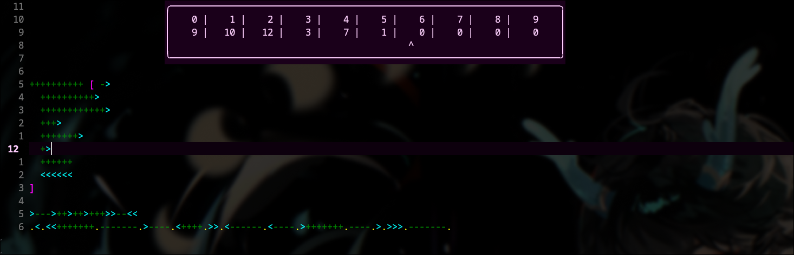

# bfDisplay-rs 

A Neovim plugin for live brainfuck debugging, powered by a Rust backend via msgpack-RPC.

As you move your cursor through a .bf file, the plugin displays the state of the tape up to that point in a floating window, 
showing cell indices, values, the pointer position, and a warning if an infinite loop is detected.



Note: this delegates all interpreting logic to a **non-blocking** rust binary, for speed and so that stuff like infinite loops dont lag out nvim.

After you have the plugin installed, just run ```:BfrsStart``` in nvim while viewing a ```.bf```  file to initiate the display :3

Disclaimer: the lua code is terrible i dont know lua and i hate working with it

---

## Installation

Add both the compiled binary (downloaded from releases or compiled yourself) and the ```bfDisplay.lua``` file to your nvim plugins directory,
which should be ```~/.config/nvim/lua/```

Once that is done, add this line to your ```init.lua```: 
```
require("bfDisplay-rs").setup()
```

Thats it! After you reload nvim, you should have the plugin working :3

---

## Brainfuck spec compliance + specificities

- Tape has 30,000 cells, each holding an unsigned wrapping 8 bit integer
- Pointer wraps around when going under 0 or over 29,999
- Unmatched brackets are silently ignored\
*this allows the debugger to work correctly as code is being written and is intentional*
- Infinite loop detection, through a maximum amount of steps (default is 100,000,000 which should be plenty for most programs, if it isnt then may god be with you)\
*if you find that the maximum amount of steps is too low, you can change the MAX_STEPS const in constants.rs and recompile the binary*
- All instructions ***should*** be correct, [ will jump to ] if pointer is 0, etc etc

---

## Customization

This plugin comes with various customization constants, that you can find at the top of the bfDisplay-rs.lua file.
```lua
AUTOSTART = false -- Auto start display on opening a .bf file
DISPLAY_HEIGHT = 4 -- Amount of lines to display at once
```

---

## Todos

- maybe polish the actual display window
- add syntax highlighting 
- add advanced interpreter
- optimise rpcnotify to not send a 30k char array (good god)
- add customization constants
- stop globally setting scroll speed lmao
