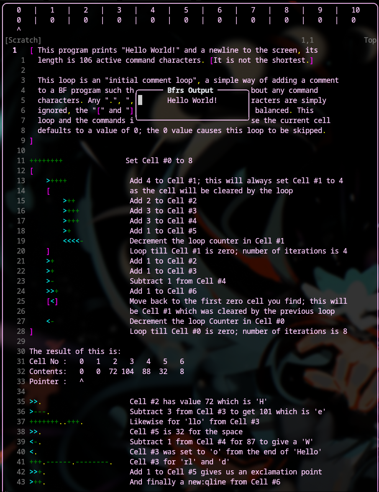
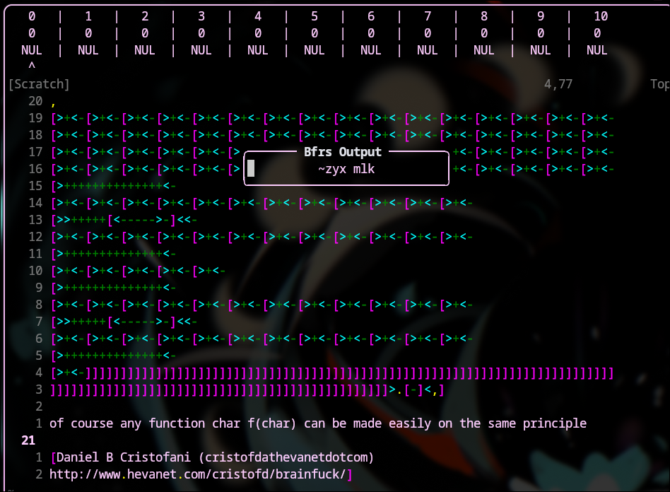
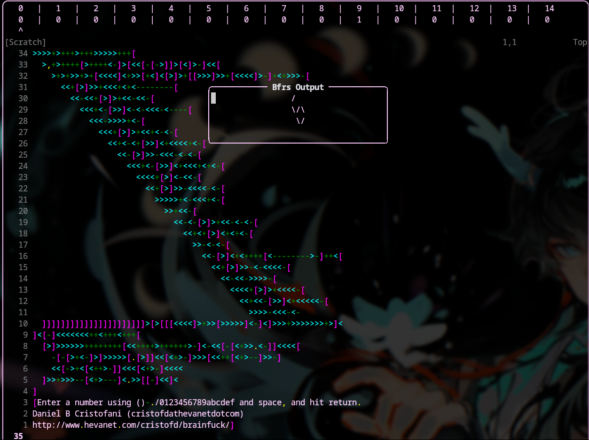

# bfDisplay-rs 

A Neovim plugin for live brainfuck debugging, powered by a Rust backend via msgpack-RPC.

As you move your cursor through a .bf file, the plugin displays the state of the tape up to that point in the top split, 
showing cell indices, values, the pointer position, and a warning if an infinite loop is detected.

Also includes a simple interpreter that handles i/o, through neovim user commands



Note: this delegates all interpreting logic to a **non-blocking** rust binary, for speed and so that stuff like infinite loops dont lag out nvim.

After you have the plugin installed, just run ```:BfrsStart``` in nvim while viewing a ```.bf```  file to initiate the display :3

**Disclaimers:**
- the lua code is "written" by compiling ts into lua through [TypeScriptToLua](https://github.com/TypeScriptToLua/TypeScriptToLua)
- with more complex code, this kinda starts to fall apart since reinterpreting your code every time you type a character is bad\
*if you really wanna, you can just increase the step limit dont complain if it breaks or is slow tho*

---

## Installation

Baseline for installation is you need **BOTH** compiled files in your nvim plugins directory, as well as calling the plugin in your init.lua.

You have two main options for doing this:

### Option 1 - From Releases

Simply go into [Releases](https://github.com/catboylei/bfDisplay-rs/releases), grab both the ```bfDisplay-rs.lua``` and the ```bfDisplay``` binary, 
and simply place them in ```~/.config/nvim/lua/```

### Option 2 - Compile yourself (cargo and tstl required)

This is the better option if you wish to edit constants or other customizations, simply clone the repo and then run the Makefile:

```bash
git clone https://github.com/catboylei/bfDisplay-rs.git
# cd into the main directory
make build
```
The makefile only serves to run cargo & tstl, then cp the compiled files into the nvim directory.

### Add to Nvim:
Once that is done, add this line to your ```init.lua```: 
```
require("bfDisplay-rs").setup()
```

Thats it! After you reload nvim, you should have the plugin working :3

---

## Brainfuck spec compliance + specificities

- correctly passed all compliance tests from https://brainfuck.org/
- Tape has 30,000 cells, each holding an unsigned wrapping 8 bit integer
- Pointer wraps around when going under 0 or over 29,999
- Unmatched brackets are silently ignored\
*this allows the debugger to work correctly as code is being written and is intentional*
- Live approximative infinite loop detection (max step limit, default is 1,000,000) 
- Step limit of the interpreter is 1,000,000,000

---

## Commands

```
:BfrsStart -- Force start the plugin
:BfrsStop -- Force stop the plugin
:BfrsPing -- Check if the backend is reached
:BfrsRun <input> -- Display output with given input 
```
---

## Customization

This plugin comes with various customization constants, that you can find at the top of the constants.ts file.
```typescript
export const AUTOSTART: boolean = true;
export const PATTERNS: string = '{*.bf,*.b,*.brainfuck}';
export const DISPLAY_ROWS: number = 1;
```

---
## Examples

Running rot13 from [brainfuck.org](https://brainfuck.org/rot13.b) with "~mlk zyx" as input:

Running numwarp from [brainfuck.org](https://brainfuck.org/numwarp.b) with "6" as input:


## Todos

- add syntax highlighting
- add customization constants